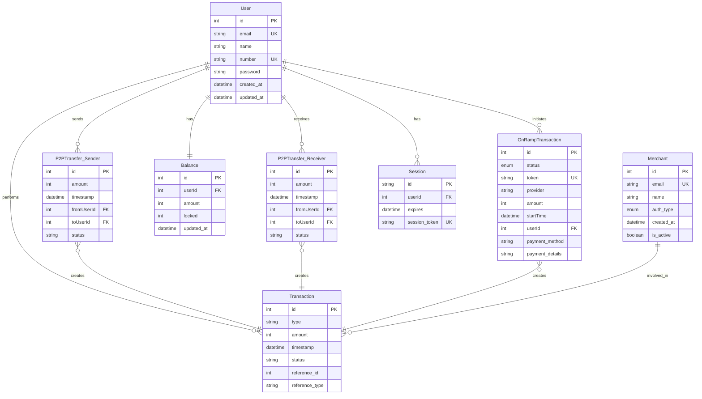

# Digital Wallet Database Design Documentation

## Overview

This document outlines the database design for a digital wallet application built on Next.js. The system supports user authentication, money transfers between users (P2P), on-ramp transactions (loading money into the platform), and balance management.

## Database Technology Selection

### Primary Database: PostgreSQL

PostgreSQL has been selected as the primary database for the following reasons:

1. **Strong ACID Compliance**: Essential for financial transactions where data integrity is critical
2. **Transactional Support**: Native support for complex transactions with proper isolation levels
3. **Data Integrity**: Robust constraints, foreign keys, and validation capabilities
4. **Scalability**: Capable of handling growth in both data volume and user base
5. **JSON Support**: Offers flexibility for storing semi-structured data when needed
6. **Existing Integration**: The application already uses Prisma ORM with PostgreSQL

### Caching Layer: Redis (Recommended Addition)

We recommend adding Redis as a caching layer for:

1. **Session Management**: Fast, in-memory session storage
2. **Rate Limiting**: Protect sensitive endpoints from abuse
3. **Frequently Accessed Data**: Cache user profiles and balances for quicker access
4. **Transaction Queue**: Temporary storage for transaction processing

## Data Model

### Core Entities

The database schema consists of the following core entities:

1. **User**: Account holders who can send/receive money
2. **Balance**: Users' current monetary balances
3. **P2PTransfer**: Peer-to-peer money transfers between users
4. **OnRampTransaction**: Money loaded onto the platform
5. **Merchant**: External business entities

### Entity Relationship Diagram (ERD)



## Schema Design

### User

The central entity representing system users.

```prisma
model User {
  id                Int                @id @default(autoincrement())
  email             String?            @unique
  name              String?
  number            String             @unique
  password          String
  created_at        DateTime           @default(now())
  updated_at        DateTime           @updatedAt
  
  // Relations
  onRampTransactions OnRampTransaction[]
  balance            Balance?
  sentTransfers      P2PTransfer[]     @relation(name: "FromUserRelation")
  receivedTransfers  P2PTransfer[]     @relation(name: "ToUserRelation")
  sessions           Session[]
  transactions       Transaction[]
}
```

### Balance

Stores the current financial state of each user.

```prisma
model Balance {
  id        Int      @id @default(autoincrement())
  userId    Int      @unique
  amount    Int      // Stored in cents/smallest currency unit
  locked    Int      // Amount temporarily locked for pending transactions
  updated_at DateTime @updatedAt
  
  // Relations
  user      User     @relation(fields: [userId], references: [id])
}
```

### P2PTransfer

Records money transfers between users.

```prisma
model P2PTransfer {
  id         Int       @id @default(autoincrement())
  amount     Int       // Stored in cents/smallest currency unit
  timestamp  DateTime  @default(now())
  status     String    @default("completed")
  
  // Relations
  fromUserId Int
  fromUser   User      @relation(name: "FromUserRelation", fields: [fromUserId], references: [id])
  toUserId   Int
  toUser     User      @relation(name: "ToUserRelation", fields: [toUserId], references: [id])
  transaction Transaction?

  @@index([fromUserId])
  @@index([toUserId])
  @@index([timestamp])
}
```

### OnRampTransaction

Records money loaded into the platform.

```prisma
model OnRampTransaction {
  id              Int          @id @default(autoincrement())
  status          OnRampStatus
  token           String       @unique
  provider        String
  amount          Int          // Stored in cents/smallest currency unit
  startTime       DateTime
  payment_method  String?      // e.g., "credit_card", "bank_transfer"
  payment_details Json?        // Flexible schema for provider-specific details
  
  // Relations
  userId          Int
  user            User         @relation(fields: [userId], references: [id])
  transaction     Transaction?

  @@index([userId])
  @@index([startTime])
}

enum OnRampStatus {
  Success
  Failure
  Processing
}
```

### Merchant

Represents businesses that may integrate with the platform.

```prisma
model Merchant {
  id        Int       @id @default(autoincrement())
  email     String    @unique
  name      String?
  auth_type AuthType
  created_at DateTime @default(now())
  is_active Boolean   @default(true)
  
  // Relations
  transactions Transaction[]
}

enum AuthType {
  Google
  Github
  ApiKey
}
```

### Transaction (New Model)

A unified transaction ledger for better tracking and reporting.

```prisma
model Transaction {
  id             Int       @id @default(autoincrement())
  type           String    // "p2p", "onramp", "merchant_payment", etc.
  amount         Int       // Stored in cents/smallest currency unit
  timestamp      DateTime  @default(now())
  status         String    @default("completed")
  reference_id   Int       // ID of the related transaction record
  reference_type String    // Model name of the related transaction
  
  // Relations
  userId         Int
  user           User      @relation(fields: [userId], references: [id])
  merchantId     Int?
  merchant       Merchant? @relation(fields: [merchantId], references: [id])
  p2pTransfer    P2PTransfer? @relation(fields: [reference_id], references: [id])
  onrampTransaction OnRampTransaction? @relation(fields: [reference_id], references: [id])

  @@index([userId])
  @@index([merchantId])
  @@index([timestamp])
  @@index([type])
  @@index([status])
}
```

### Session (New Model)

For secure session management.

```prisma
model Session {
  id           String   @id
  userId       Int
  expires      DateTime
  session_token String  @unique
  
  // Relations
  user         User     @relation(fields: [userId], references: [id])

  @@index([userId])
}
```

## Indexing Strategy

The following indexes have been implemented to optimize common query patterns:

### Primary Keys
- Every table has an auto-incrementing integer primary key

### Foreign Keys
- All relationship fields are indexed for faster joins

### Performance Indexes
1. **P2PTransfer**:
   - `fromUserId`, `toUserId` - Frequent filtering by sender/receiver
   - `timestamp` - For chronological sorting and time-based queries

2. **OnRampTransaction**:
   - `userId` - Filter transactions by user
   - `startTime` - Time-based queries and sorting

3. **Transaction**:
   - `userId` - Filter all user transactions
   - `merchantId` - Filter by merchant 
   - `timestamp` - Time-based queries
   - `type` - Filter by transaction type
   - `status` - Filter by status (completed, pending, failed)

4. **Session**:
   - `userId` - Fast lookup of user sessions

### Unique Constraints
- `User.email` - Prevents duplicate email registrations
- `User.number` - Ensures phone numbers are unique
- `OnRampTransaction.token` - Ensures transaction tokens are unique
- `Session.session_token` - Ensures session tokens are unique

## Data Access Patterns

### Common Access Patterns

1. **User Authentication**:
   - Lookup user by email/phone for authentication
   - Session validation

2. **Balance Checking**:
   - Retrieve current user balance 
   - Check available funds before transfers

3. **Transaction History**:
   - List all transactions for a user
   - Filter transactions by type, date range, or status
   - Calculate balance over time for charts/analytics

4. **P2P Transfers**:
   - Atomically update both sender and receiver balances
   - Record transfer details with proper transaction isolation

5. **OnRamp Processing**:
   - Create pending transactions
   - Update transaction status and user balance upon completion

### Optimized Queries

For common operations, we recommend these optimized query patterns:

1. **User Dashboard Summary**:
```sql
SELECT 
  u.name, 
  b.amount as balance, 
  COUNT(DISTINCT p.id) as total_transfers,
  COUNT(DISTINCT o.id) as total_onramps
FROM "User" u
LEFT JOIN "Balance" b ON u.id = b.userId
LEFT JOIN "P2PTransfer" p ON u.id = p.fromUserId OR u.id = p.toUserId
LEFT JOIN "OnRampTransaction" o ON u.id = o.userId
WHERE u.id = $userId
GROUP BY u.id, u.name, b.amount;
```

2. **Recent Transaction History**:
```sql
SELECT 
  t.id, 
  t.type, 
  t.amount, 
  t.timestamp, 
  t.status
FROM "Transaction" t
WHERE t.userId = $userId
ORDER BY t.timestamp DESC
LIMIT 10;
```

3. **Monthly Transaction Volume**:
```sql
SELECT 
  DATE_TRUNC('month', timestamp) as month,
  SUM(amount) as total_amount,
  COUNT(*) as transaction_count
FROM "Transaction"
WHERE userId = $userId
  AND timestamp >= NOW() - INTERVAL '6 months'
GROUP BY DATE_TRUNC('month', timestamp)
ORDER BY month;
```

## Transaction Management

For financial operations, proper transaction isolation is critical:

```typescript
await prisma.$transaction(async (tx) => {
  // Lock the relevant rows
  await tx.$queryRaw`SELECT * FROM "Balance" WHERE "userId" = ${senderId} FOR UPDATE`;
  await tx.$queryRaw`SELECT * FROM "Balance" WHERE "userId" = ${receiverId} FOR UPDATE`;

  // Check balance
  const senderBalance = await tx.balance.findUnique({
    where: { userId: senderId },
  });
  
  if (!senderBalance || senderBalance.amount < amount) {
    throw new Error('Insufficient funds');
  }

  // Update balances atomically
  await tx.balance.update({
    where: { userId: senderId },
    data: { amount: { decrement: amount } },
  });
  
  await tx.balance.update({
    where: { userId: receiverId },
    data: { amount: { increment: amount } },
  });

  // Record the transfer
  const transfer = await tx.p2pTransfer.create({
    data: {
      fromUserId: senderId,
      toUserId: receiverId,
      amount,
      timestamp: new Date()
    }
  });

  // Record in unified transaction ledger
  await tx.transaction.create({
    data: {
      type: "p2p",
      amount,
      userId: senderId,
      status: "completed",
      reference_id: transfer.id,
      reference_type: "P2PTransfer"
    }
  });
});
```

## Performance Considerations

1. **Connection Pooling**: Configure Prisma with proper connection pooling for production environments.

2. **Query Optimization**:
   - Use appropriate indexes for common query patterns
   - Avoid N+1 query issues by using Prisma's `include` for related data
   - For complex reports, consider using raw SQL queries

3. **Database Scaling**:
   - Start with vertical scaling (larger instances) as user base grows
   - Consider read replicas for reporting queries
   - Implement proper database partitioning strategy for transaction history as it grows

4. **Caching Strategy**:
   - Cache frequently accessed user profiles and balances in Redis
   - Implement cache invalidation on balance updates
   - Use distributed locking with Redis for high-concurrency scenarios

## Data Migration Strategy

For the proposed schema changes:

1. **Preparation Phase**:
   - Create backup of current database
   - Test migrations in staging environment
   - Schedule maintenance window for production changes

2. **Migration Process**:
   - Add new fields with NULL constraints initially
   - Create new tables with temporary names
   - Populate new tables from existing data
   - Create required indexes
   - Switch to new schema in a transaction when possible

3. **Rollback Plan**:
   - Maintain scripts to revert all changes
   - Keep original data until new schema is verified

## Security Considerations

1. **Password Storage**:
   - Continue using bcrypt for password hashing
   - Consider increasing work factor for stronger security

2. **Transaction Security**:
   - Implement rate limiting for sensitive operations
   - Add fraud detection patterns based on transaction patterns
   - Log all security-relevant events

3. **Data Protection**:
   - Encrypt sensitive data at rest
   - Use parameterized queries to prevent SQL injection
   - Implement proper access controls in application code

## Monitoring and Maintenance

1. **Performance Monitoring**:
   - Track query performance with database monitoring tools
   - Set alerts for slow queries and unusual load patterns
   - Monitor connection pool usage and errors

2. **Routine Maintenance**:
   - Schedule regular VACUUM operations to reclaim space
   - Update statistics for query optimizer
   - Archive old transaction data to maintain performance

3. **Backup Strategy**:
   - Implement point-in-time recovery capability
   - Test database restoration procedures regularly
   - Consider streaming replication for disaster recovery

## Conclusion

This database design provides a solid foundation for a secure, scalable digital wallet application. The schema supports all current functionality while adding improvements for better performance, security, and future scalability. The unified transaction table enables better reporting and auditing capabilities, while proper indexing ensures optimal query performance as the application grows.