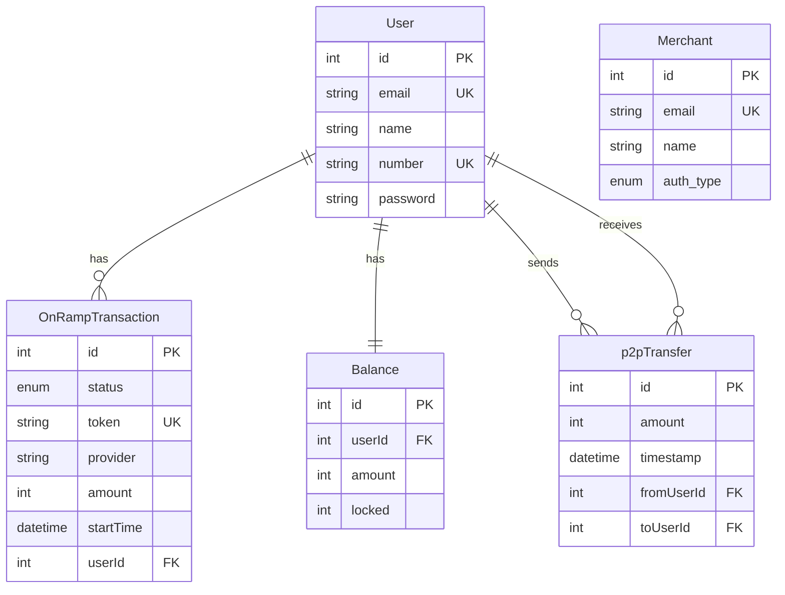

```mermaid
erDiagram
    User {
        int id PK
        string email UK
        string name
        string number UK
        string password
    }
    
    Balance {
        int id PK
        int userId FK
        int amount
        int locked
    }
    
    p2pTransfer {
        int id PK
        int amount
        datetime timestamp
        int fromUserId FK
        int toUserId FK
    }
    
    OnRampTransaction {
        int id PK
        enum status
        string token UK
        string provider
        int amount
        datetime startTime
        int userId FK
    }
    
    Merchant {
        int id PK
        string email UK
        string name
        enum auth_type
    }
    
    User ||--o{ OnRampTransaction : "has"
    User ||--|| Balance : "has"
    User ||--o{ p2pTransfer : "sends"
    User ||--o{ p2pTransfer : "receives"
```