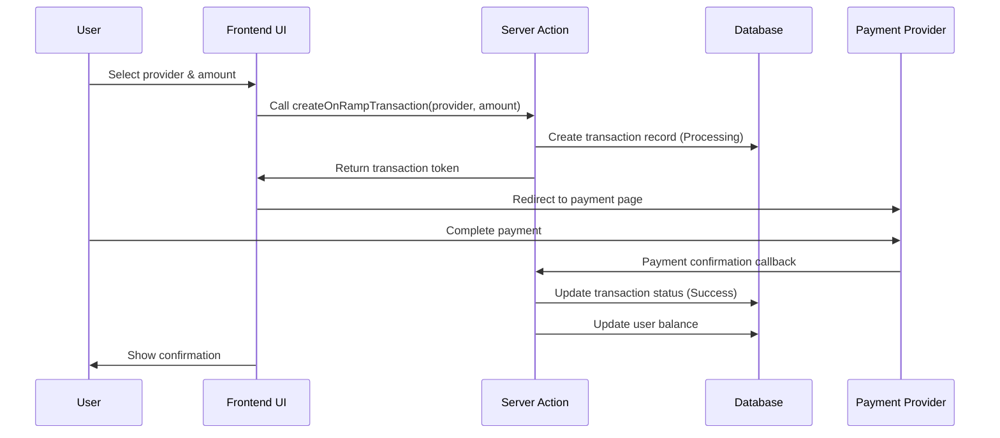

```mermaid
sequenceDiagram
    participant User as User
    participant UI as Frontend UI
    participant API as Server Action
    participant DB as Database
    participant Provider as Payment Provider
    
    User->>UI: Select provider & amount
    UI->>API: Call createOnRampTransaction(provider, amount)
    API->>DB: Create transaction record (Processing)
    API->>UI: Return transaction token
    UI->>Provider: Redirect to payment page
    User->>Provider: Complete payment
    Provider->>API: Payment confirmation callback
    API->>DB: Update transaction status (Success)
    API->>DB: Update user balance
    UI->>User: Show confirmation
```