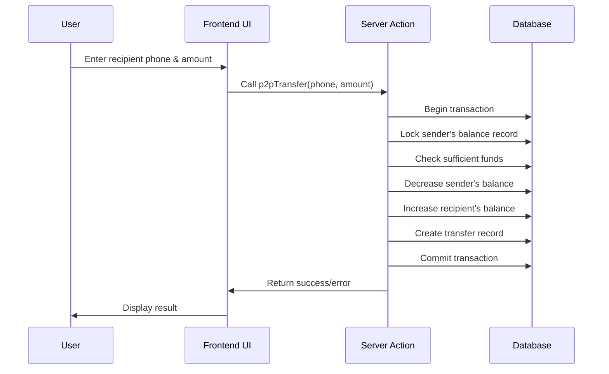

```mermaid
sequenceDiagram
    participant User as User
    participant UI as Frontend UI
    participant API as Server Action
    participant DB as Database
    
    User->>UI: Enter recipient phone & amount
    UI->>API: Call p2pTransfer(phone, amount)
    API->>DB: Begin transaction
    API->>DB: Lock sender's balance record
    API->>DB: Check sufficient funds
    API->>DB: Decrease sender's balance
    API->>DB: Increase recipient's balance
    API->>DB: Create transfer record
    API->>DB: Commit transaction
    API->>UI: Return success/error
    UI->>User: Display result
```