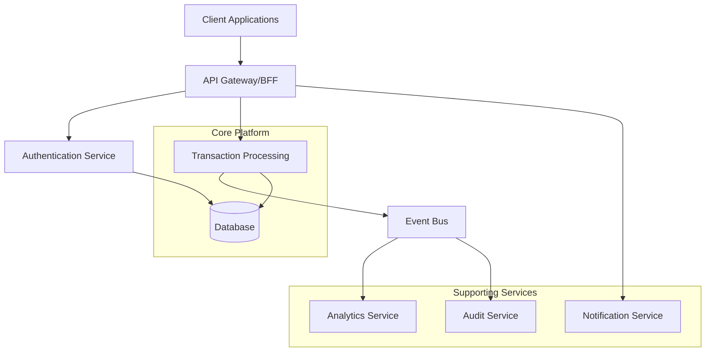
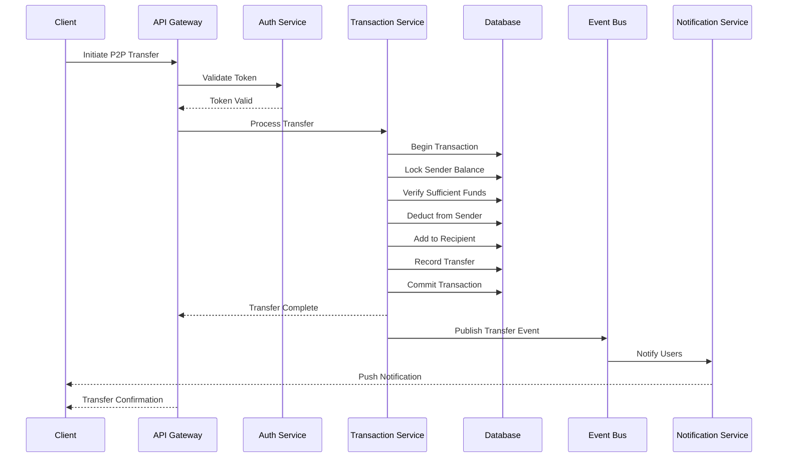

# Digital Wallet Application Architecture Proposal

## Executive Summary

This architecture proposal outlines a comprehensive design for scaling the digital wallet application. After a thorough analysis of the existing codebase, we recommend a hybrid architecture that combines a modular monolith core with selective microservices for high-scale components. This approach balances development velocity with operational resilience and provides a clear path for future growth.

The proposed architecture emphasizes strong transaction integrity, domain-driven design principles, and a progressive enhancement strategy that allows the application to evolve while maintaining backward compatibility. By separating core domains (user management, transaction processing, balance management) and implementing proper bounded contexts, we create a foundation that can handle increasing transaction volumes while supporting future expansion into adjacent financial services.

## System Requirements

Based on the codebase analysis, we've identified the following key requirements:

### Functional Requirements
1. **User Authentication & Management** 
   - Support phone number and email-based user registration
   - Secure authentication with password protection 
   - Session management for authenticated users

2. **Transaction Processing**
   - P2P money transfers between users
   - On-ramp transactions from external providers
   - Transaction history and reporting
   - Real-time balance updates

3. **Financial Management**
   - Balance tracking with locked/available amounts
   - Prevention of overdrafts and double-spending
   - Support for multiple transaction types

### Non-Functional Requirements
1. **Performance**
   - Support for concurrent transactions (as seen in performance tests)
   - Quick response times for financial operations (<500ms)
   - Ability to scale to handle peak transaction loads

2. **Security**
   - Secure storage of sensitive user data (passwords, financial information)
   - Proper transaction isolation to prevent race conditions
   - Protection against common web vulnerabilities

3. **Reliability**
   - ACID compliance for financial transactions
   - Resilience against partial failures
   - Consistent data state across system components

4. **Scalability**
   - Horizontal scaling capability for transaction processing
   - Ability to handle growing user base
   - Support for future financial service expansions

5. **Maintainability**
   - Clear separation of concerns for easier feature development
   - Testability across all layers of the application
   - Consistent coding patterns and practices

## Proposed Architecture

### High-Level Architecture

The proposed architecture follows a hybrid approach that combines:

1. **Modular Monolith Core** - For maintaining transaction integrity and simplifying development
2. **Domain-Driven Design** - For clear separation of business domains
3. **Selective Microservices** - For components requiring independent scaling
4. **Event-Driven Communication** - For asynchronous processing where appropriate

### Component Breakdown

#### 1. API Layer
- **Backend for Frontend (BFF)** - Optimized API endpoints for different client experiences
- **API Gateway** - Central entry point for all client requests, handling authentication, rate limiting, and routing
- **GraphQL API** (future enhancement) - For more flexible data querying with reduced network overhead

#### 2. Core Domain Services

**Authentication Domain**
- User registration and authentication
- Session management
- Profile information handling

**Transaction Domain**
- P2P transfer processing with transaction isolation
- On-ramp transaction handling
- Transaction validation and business rules

**Balance Domain**
- Balance management with locking mechanisms
- Ledger updates
- Consistency checks

**Merchant Domain**
- Merchant registration and management
- Payment processing for merchants

#### 3. Supporting Services

**Notification Service**
- Transaction alerts and confirmations
- Security notifications
- Marketing communications

**Analytics Service**
- Transaction pattern analysis
- User behavior insights
- Business intelligence reporting

**Audit Service**
- Comprehensive transaction logging
- Regulatory compliance reporting
- Fraud detection patterns

#### 4. Data Storage

**Primary Database**
- PostgreSQL for transactional data with strong consistency requirements
- Optimized schema design with proper indexing for financial transactions

**Caching Layer**
- Redis for high-speed data access
- User session data, frequently accessed balances

**Event Store**
- Append-only log for all financial transactions
- Source of truth for event sourcing patterns
- Basis for audit trail and system reconciliation

### Data Flow Architecture

For critical paths like P2P transfers, the architecture prioritizes data consistency:

## Technology Stack

### Frontend
- **Framework**: Next.js (currently in use)
- **State Management**: React Context with SWR for data fetching
- **UI Components**: Tailwind CSS for styling (currently in use)
- **Client-Side Validation**: Zod (currently in use)

### Backend
- **API Framework**: Next.js API Routes (currently in use), transitioning to dedicated Express services for high-traffic endpoints
- **Authentication**: NextAuth.js with JWT (currently in use), extended with additional security measures
- **Validation**: Zod for type-safe validation (currently in use)

### Database
- **Primary Database**: PostgreSQL (currently in use)
- **ORM**: Prisma (currently in use)
- **Connection Pooling**: PgBouncer for efficient database connection management
- **Migration Tool**: Prisma Migrate (currently in use)

### Infrastructure
- **Containerization**: Docker for consistent deployment environments
- **Orchestration**: Kubernetes for container management and scaling
- **CI/CD**: GitHub Actions for automated testing and deployment
- **Monitoring**: Prometheus for metrics collection, Grafana for visualization
- **Logging**: ELK stack (Elasticsearch, Logstash, Kibana) for centralized logging
- **Caching**: Redis for high-speed data caching

### DevOps & Tooling
- **API Documentation**: Swagger/OpenAPI
- **Testing**: Jest (currently in use), Cypress for E2E testing
- **Performance Testing**: k6 for load testing
- **Security Scanning**: SonarQube, OWASP dependency scanning

## Design Justification

### Architectural Pattern Selection

The hybrid architecture (modular monolith with selective microservices) was chosen based on the following considerations:

1. **Transaction Integrity vs. Distribution**: Financial transactions require strong consistency guarantees, which are more straightforward to implement in a monolithic design. The current application demonstrates this with database transactions for P2P transfers.

2. **Team Size and Velocity**: Smaller to mid-sized teams typically achieve higher velocity with monolithic architectures in the early stages. The codebase structure suggests a focused team where communication overhead should be minimized.

3. **Current Technology Investment**: The application is built with Next.js, which provides a unified framework for both frontend and backend. Leveraging this investment while progressively enhancing specific components offers the best balance of innovation and stability.

4. **Operational Complexity**: Fully distributed microservices require significant operational overhead for monitoring, deployment, and troubleshooting. The hybrid approach reduces this complexity while allowing targeted scaling.

### Database Selection Justification

PostgreSQL remains the recommended database for the following reasons:

1. **ACID Compliance**: Essential for financial transactions, as demonstrated in the P2P transfer implementation that uses transactions.

2. **JSON Support**: Allows flexible schema evolution where needed while maintaining structured data for core financial records.

3. **Scaling Capabilities**: Modern PostgreSQL offers horizontal scaling options through read replicas and partitioning, suitable for the expected growth trajectory.

4. **Developer Familiarity**: The team is already using Prisma with PostgreSQL, minimizing the learning curve.

### Trade-offs Considered

**Monolith vs. Microservices**:
- **Pro for Microservices**: Independent scaling and deployment of components
- **Pro for Monolith**: Simplified development workflow and transaction management
- **Decision**: Hybrid approach to get benefits of both patterns while minimizing drawbacks

**SQL vs. NoSQL**:
- **Pro for NoSQL**: Schema flexibility, potentially higher write throughput
- **Pro for SQL**: ACID transactions, structured queries, referential integrity
- **Decision**: Stay with PostgreSQL for core financial data, potentially introduce NoSQL for analytics and non-transactional data

**Server Rendering vs. Client Rendering**:
- **Pro for Server Rendering**: Better SEO, faster initial load, more secure handling of sensitive data
- **Pro for Client Rendering**: Richer interactive experience, reduced server load
- **Decision**: Continue with Next.js hybrid rendering approach, using server components for sensitive operations and client components for interactivity

## Non-Functional Aspects

### Scalability

The architecture addresses scalability through:

1. **Horizontal Scaling**: API and application services designed for horizontal scaling behind load balancers

2. **Database Scaling Strategy**:
   - Connection pooling to optimize database connections
   - Read replicas for scaling read operations
   - Database sharding strategy for future ultra-high scale (by user ID ranges)

3. **Caching Strategy**:
   - Multi-level caching (application, distributed cache, database)
   - Cache invalidation patterns aligned with transaction boundaries

4. **Asynchronous Processing**:
   - Non-critical operations moved to background processing
   - Event-driven architecture for loosely coupled scaling

### Security

The security architecture includes:

1. **Authentication Enhancements**:
   - Multi-factor authentication option for high-value accounts
   - Enhanced session management with device fingerprinting
   - Rate limiting for authentication attempts

2. **Transaction Security**:
   - Anomaly detection for unusual transaction patterns
   - Transaction signing for high-value transfers
   - Proper implementation of idempotency to prevent duplicate transactions

3. **Data Protection**:
   - Encryption of sensitive data at rest and in transit
   - Proper key management and rotation procedures
   - Data minimization principles to reduce exposure

4. **API Security**:
   - Input validation at all entry points (already using Zod)
   - OWASP Top 10 protections
   - API rate limiting and monitoring

### Observability

The observability strategy includes:

1. **Comprehensive Logging**:
   - Structured logging with consistent correlation IDs
   - Transaction lifecycle logging
   - Error logging with context for troubleshooting

2. **Metrics Collection**:
   - Business metrics (transaction volume, success rates)
   - Technical metrics (response times, error rates, resource utilization)
   - Custom dashboards for different stakeholders

3. **Distributed Tracing**:
   - OpenTelemetry integration for end-to-end request tracking
   - Performance bottleneck identification
   - Service dependency visualization

4. **Alerting and Incident Response**:
   - Automated alerts based on key metrics and SLOs
   - Incident response playbooks for common scenarios
   - On-call rotation for critical issues

### Deployability

The deployment strategy focuses on:

1. **Infrastructure as Code**:
   - Terraform for cloud resource provisioning
   - Kubernetes manifests for container orchestration
   - Automated environment creation for testing and staging

2. **CI/CD Pipeline**:
   - Automated testing for all code changes
   - Progressive deployment strategy (canary, blue/green)
   - Automated rollback procedures for failed deployments

3. **Environment Parity**:
   - Containerized development environments matching production
   - Configuration management through environment variables
   - Secrets management for secure credential handling

## Implementation Plan

The proposed architecture will be implemented in phases to minimize disruption while progressively enhancing the system:

### Phase 1: Foundation Strengthening (1-2 months)
- Refactor existing monolith into clearer domain boundaries
- Implement comprehensive logging and monitoring
- Enhance database performance with proper indexing and connection pooling
- Implement automated testing across all critical paths

### Phase 2: Core Service Stability (2-3 months)
- Extract authentication into a separate service with enhanced security
- Implement event sourcing for critical financial transactions
- Develop comprehensive API documentation
- Create deployment automation for the core platform

### Phase 3: Scaling and Extension (3-4 months)
- Implement caching strategy for frequently accessed data
- Extract notification service for asynchronous processing
- Develop analytics capabilities for business intelligence
- Enhance monitoring with business metrics and dashboards

### Phase 4: Advanced Features (4-6 months)
- Implement additional financial services (recurring payments, scheduled transfers)
- Develop fraud detection capabilities
- Integrate with additional payment providers
- Implement advanced reporting and compliance features

## Conclusion

This architecture proposal provides a clear path forward for evolving the digital wallet application into a robust, scalable financial platform. By adopting a hybrid architectural approach that emphasizes strong transaction integrity, domain-driven design, and progressive enhancement, we can maintain the development velocity while building a system capable of supporting significant growth.

The proposed technology stack leverages existing investments while introducing targeted enhancements for improved scalability, security, and maintainability. The phased implementation plan allows for continuous improvement without disrupting existing operations.

With this architecture in place, the digital wallet application will be well-positioned to handle increasing transaction volumes, expand its feature set, and adapt to changing market requirements.